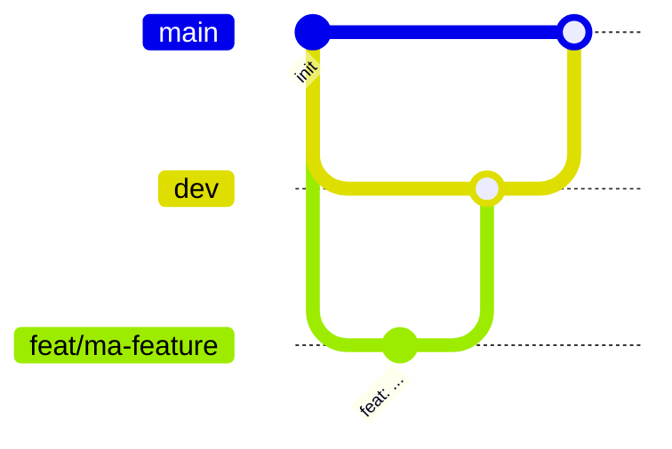

# EventHub

Plateforme de gestion d'événements et de billetterie en ligne
(projet fil rouge CDA - 3WA).

## Stack

React + TypeScript · Node.js/Express + TypeScript · PostgreSQL/MySQL · NoSQL · Redis · Nginx · Docker

## Conventions de commit

Ce projet suit la spécification [Conventional Commits](https://www.conventionalcommits.org/fr/v1.0.0/).

### Format

```
<type>(<scope>): <description courte à l'impératif>
```

### Types autorisés

| Type       | Usage                                          |
| ---------- | ---------------------------------------------- |
| `feat`     | Nouvelle fonctionnalité                        |
| `fix`      | Correction de bug                              |
| `docs`     | Documentation uniquement                       |
| `style`    | Formatage (sans changement de logique)         |
| `refactor` | Réécriture sans ajout de feature ni correction |
| `perf`     | Amélioration de performance                    |
| `test`     | Ajout ou modification de tests                 |
| `build`    | Build, dépendances, Docker                     |
| `ci`       | Configuration CI/CD                            |
| `chore`    | Tâches diverses (config, maintenance)          |
| `revert`   | Annulation d'un commit précédent               |

### Règles

- Description en minuscules, sans point final, 72 caractères max
- Verbe à l'impératif : `add`, `fix`, `update`
- Breaking change : `feat!:` ou footer `BREAKING CHANGE: ...`

### Exemples

```
feat(auth): add JWT login endpoint
fix(booking): prevent double reservation on same seat
docs(readme): add commit conventions
chore: setup husky and lint-staged
```

## Hooks Git

Husky + lint-staged + commitlint vérifient automatiquement
le format du code et des messages de commit.

## Workflow Git



- `main` : production, protégée
- `dev` : intégration, protégée
- branches éphémères (`feat/`, `fix/`, ...) : créées depuis `dev`, fusionnées par PR, puis supprimées
